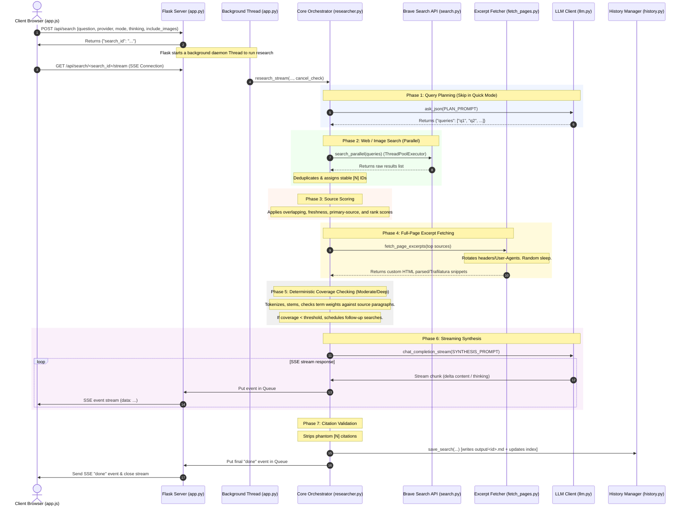

# AI Research Assistant — Architecture & Implementation Walkthrough

This document is a comprehensive, self-contained system spec and codebase walk-through. It is designed to give AI developers (and assistant models) an immediate, high-fidelity understanding of the system's architecture, data flows, core algorithms, and implementation details without needing to inspect individual files.

---

## 1. System Architecture & Lifecycle Flow

Here is a visual representation of how a user's question is planned, searched, scored, enriched, verified for coverage, synthesized by the LLM, and streamed back to the browser.



---

## 2. Key Data Models & Schemas

### 2.1 Source Schema
Inside the `SourceRegistry` ([sources.py](file:///Users/isr431/Documents/Projects/research-assistant/sources.py)), sources are assigned incrementing integer IDs and stored as a dictionary mapping `source_id` to:
```python
{
    "url": str,                  # Normalized primary identifier URL
    "title": str,                # Search page title
    "domain": str,               # Host name (without www prefix)
    "date": str,                 # Publication date extracted by Brave
    "snippets": list[str],       # Collected list of unique snippet strings
    "query_origins": list[str],  # Search sub-queries that returned this URL
    "query_index": int,          # Zero-based index of the sub-query that first found it
    "result_rank": int,          # Organic result rank from Brave search (1-indexed)
    "source_score": float,       # Dynamically calculated relevance score
    "page_fetch_status": str,    # Optional. Status of full-page fetch (e.g., "fetched", "blocked by site...")
    "page_excerpt": str,         # Optional. Distilled excerpt text matching sub-query terms
}
```

### 2.2 Streaming SSE Events
The Flask endpoint `/api/search/<id>/stream` ([app.py](file:///Users/isr431/Documents/Projects/research-assistant/app.py)) yields standard SSE events containing JSON payloads. Event types (`type`) include:

- `"status"`: Progress update notifications.
  - Payload: `{"type": "status", "message": "Searching web...", "stage": "search"}`
- `"queries"`: Search query list planned by LLM or follow-up search.
  - Payload: `{"type": "queries", "queries": [...], "phase": "initial"|"followup", "pass": int, "label": str}`
- `"sources"`: List of unique registered source headers.
  - Payload: `{"type": "sources", "sources": [{"id": int, "title": str, "url": str, "domain": str, "date": str, "query_origins": [...], "page_fetch_status": str, "has_page_excerpt": bool}]}`
- `"images"`: Side-channel image search results.
  - Payload: `{"type": "images", "images": [{"title": str, "url": str, "thumbnail_url": str, "image_url": str, "source_domain": str, "width": int, "height": int, "description": str, "rank": int}]}`
- `"gap_analysis"`: Deterministic coverage check result.
  - Payload: `{"type": "gap_analysis", "mode": str, "pass": int, "result": {"strategy": str, "summary": str, "answered": [rows], "followup_queries": [...]}}`
- `"source_fetch"`: Full-page enrichment events.
  - Payload: `{"type": "source_fetch", "mode": "top_ranked", "pass": int, "phase": str, "sources": [...], "summary": str}`
- `"thinking"`: LLM thinking/reasoning token stream.
  - Payload: `{"type": "thinking", "delta": str}`
- `"content"`: LLM answer synthesis token stream.
  - Payload: `{"type": "content", "delta": str}`
- `"done"`: End of pipeline indicator.
  - Payload: `{"type": "done", "content": str, "thinking": str, "sources": [...], "images": [...]}`
- `"cancelled"`: Triggered by user abort.
  - Payload: `{"type": "cancelled", "message": "Search cancelled."}`
- `"error"`: Triggered by pipeline exceptions.
  - Payload: `{"type": "error", "message": str}`

### 2.3 Search History MD Metadata
Saved searches are stored as markdown files with YAML front-matter and hidden metadata comments:
```markdown
---
id: abc123xyz789
title: "Sidebar Display Title"
question: "Original User Question?"
mode: "moderate"
provider: "deepseek-v4-flash"
date: "2026-06-17T20:45:40.123456"
---

[Factual synthesis content with citation tags like [1]]

---

## Model Thinking

[Raw thinking/reasoning text]

<!-- SOURCES_JSON
[JSON representation of cited sources only]
SOURCES_JSON -->

<!-- IMAGES_JSON
[JSON representation of image results]
IMAGES_JSON -->

<!-- PIPELINE_METADATA_JSON
{
  "query_events": [...],
  "gap_analyses": [...],
  "source_fetch_events": [...],
  "source_fetches": [...]
}
PIPELINE_METADATA_JSON -->
```

---

## 3. Core Algorithms & Logic

### 3.1 Relevance Scoring Heuristic
`score_sources` ([sources.py](file:///Users/isr431/Documents/Projects/research-assistant/sources.py)) assigns a numeric value to sort source context inside the LLM prompt. The formula calculates overlap terms against the combined string of the user question, sub-queries, and query origins:
- **Title Overlap Weight**: `4.0` × fraction of query terms in the page title.
- **Snippet Overlap Weight**: `2.5` × fraction of query terms in all accumulated snippets.
- **Query Origin Overlap Weight**: `1.0` × fraction of query terms in the sub-queries that generated this source.
- **Freshness Weight**: Up to `0.8` based on max calendar year found in the search result meta:
  - Age 0 years: `1.0` (factor multiplier)
  - Age 1 year: `0.6`
  - Age 2-3 years: `0.3`
  - Age >3 years or missing: `0.0`
- **Primary Source Weight**: Up to `0.8` based on domain tags:
  - `.edu` or `.gov` extension: `+0.5`
  - Subdomains starting with `developer.`, `docs.`, `newsroom.`: `+0.4`
  - Match between domain basename (e.g. `github` from `github.com`) and query terms: `+0.7`
- **Search Rank Weight**: Up to `0.5` computed from Brave ranking: `0.5 * max(0.0, 1.0 - (result_rank - 1) * 0.1)`.

### 3.2 High-Fidelity Excerpt Fetcher & Anti-Bot Evasion
To bypass CDN filters and scrapers, `fetch_page_excerpt` ([fetch_pages.py](file:///Users/isr431/Documents/Projects/research-assistant/fetch_pages.py)) implements:
- **Random Profile Selection**: Rotates between Chrome (Win/macOS) and Firefox (Win/Linux) profiles.
- **Header Synchronization**:
  - Chrome profiles include standard Chrome Client Hints (`Sec-Ch-Ua`, `Sec-Ch-Ua-Mobile`, `Sec-Ch-Ua-Platform`).
  - Firefox profiles omit Client Hints completely (matching native Firefox behavior).
  - Both inject unified navigation headers (`Upgrade-Insecure-Requests`, `Sec-Fetch-Dest`, `Sec-Fetch-Mode`, `Sec-Fetch-Site`, `Referer: https://www.google.com/`, `DNT: 1`).
  - `Accept-Encoding` is omitted so the `requests` library handles decompression automatically.
- **Evasion & Sleep Jitter**: Random delay of `0.0 - 0.5`s before any request.
- **Retry Loop**: If a `403` or `429` block occurs, it sleeps for a random `1.0 - 3.0` seconds and retries using a *different* browser profile.
- **Parser Fallback**: Trafilatura is the primary high-quality parser. If it fails or is missing, a custom `HTMLParser` skips script/style/nav/footer tags and cleans whitespace.
- **Snippet Relevance Selector**: It splits the text into paragraphs, ranks paragraphs based on token overlap with the query plus length weight (capped at 1200 chars), and stitches together the top 8 paragraphs up to `full_page_chars` limit.

### 3.3 Deterministic Coverage Check & Gap Analysis
`_deterministic_coverage_analysis` ([researcher.py](file:///Users/isr431/Documents/Projects/research-assistant/researcher.py)) tokenizes and stems queries to score matching coverage in collected documents without querying the LLM:
1. **Weighting Terms**: Assigns weights to query terms based on importance:
   - Contains a digit (e.g. "2026"): `2.0`
   - Length > 6 characters: `1.5`
   - Default word: `1.0`
2. **Block-Level Matching**: Splices documents into chunks (title/domain block, individual snippet blocks, paragraph-level page excerpts).
3. **Score calculation**: For each query, calculates the overlap term weights of the best-matching block divided by total query weights.
4. **Status Mapping**:
   - Best Block Score $\ge 0.6$: `answered`
   - Best Block Score $\ge 0.3$: `partial`
   - Best Block Score $< 0.3$: `unanswered`
5. **Follow-up Generation**: For `partial` or `unanswered` queries, constructs a new query by appending up to 4 missing stemmed terms to the original user question.

### 3.4 API-Specific Thinking/Reasoning Stream Parsing
`chat_completion_stream` ([llm.py](file:///Users/isr431/Documents/Projects/research-assistant/llm.py)) normalizes how different models output reasoning tokens:
- **OpenRouter & DeepSeek**: Yields tokens from `delta.reasoning_content` (or `delta.reasoning`) and marks them as `thinking` SSE events. OpenRouter models (such as GLM 5.2 or DeepSeek V4) request reasoning via a nested `reasoning` object configuration with standard normalized `effort` parameters.
- **Mistral**: Injected parameters `reasoning_effort="high"` force reasoning tokens through standard content streams or custom headers depending on API version.
- **Gemini**: Standardized inline tag detection state machine. Since Gemini streams thoughts inside the normal `content` key wrapped in `<thought>...</thought>` tags, `llm.py` uses a state machine:
  1. **"detect" phase**: Buffers tokens until it sees `<thought>`. It outputs anything before `<thought>` as content, then enters `thinking` phase.
  2. **"thinking" phase**: Emits tokens as `thinking` events until it sees `</thought>`. It routes trailing text as normal content and switches to `content` phase.
  3. **"content" phase**: Emits all subsequent tokens as content events.

### 3.5 Image Deduplication & Candidate Overfetching
`brave_image_search` ([search.py](file:///Users/isr431/Documents/Projects/research-assistant/search.py)):
- **Domain Filter**: Drops candidates belonging to blocked domains (e.g. TikTok) during collection.
- **Overfetching**: Requests `3x` the target display count (fetching 12 candidates to return 4) to ensure filtering doesn't leave empty slots.
- **Deduplication**: Drops duplicates by matching normalized URLs (lowercase, query-stripped, www-prefix-removed) or filename signatures (extracts the trailing slug, strips format suffixes and geometry strings like `-300x200` or `_w400`).
- **Ranking**: Calculates a quality score based on dimensions, aspect ratio (penalizes extreme ratios like $>4.0$, rewards standard ratios $\le 2.2$), description presence, and Brave rank.

---

## 4. Codebase Mapping & Tour

### Backend Entry Points & Setup
- [app.py](file:///Users/isr431/Documents/Projects/research-assistant/app.py): Entry point. Creates background threads for searches, manages thread-safe cancellation maps (`_active_searches`), processes endpoints, and handles SSE chunk outputs.
- [config.py](file:///Users/isr431/Documents/Projects/research-assistant/config.py): Contains LLM specs (`MODEL_PROVIDERS`), model presets (associating search modes with specific reasoning efforts), and Brave parameters (`SEARCH_PRESETS` for Quick, Moderate, Deep).

### The Pipeline Core
- [researcher.py](file:///Users/isr431/Documents/Projects/research-assistant/researcher.py): orchestrator. Runs `research_stream`. Invokes query planning, launches image search, calls Brave Search clients, executes source scoring, coordinates page fetching, performs coverage analysis, and streams response synthesis.
- [llm.py](file:///Users/isr431/Documents/Projects/research-assistant/llm.py): Contains `LLMClient`. Configures provider-specific reasoning params, processes streaming state machines, parses Gemini XML thought tags, and retries invalid JSON outputs.
- [prompts.py](file:///Users/isr431/Documents/Projects/research-assistant/prompts.py): Stores query planning, synthesis format rules (Quick concise, Moderate structured, Deep report), and JSON correction feedback templates.

### Data Fetching & Processing
- [search.py](file:///Users/isr431/Documents/Projects/research-assistant/search.py): brave search API connector. Implements concurrent queries via `ThreadPoolExecutor`, maintains stable index ranks, and ranks/deduplicates image assets.
- [fetch_pages.py](file:///Users/isr431/Documents/Projects/research-assistant/fetch_pages.py): Web scraper. Manages browser headers/user-agent rotation, retries transient network locks, parses content using Trafilatura or HTMLParser, and filters relevant paragraph fragments.
- [sources.py](file:///Users/isr431/Documents/Projects/research-assistant/sources.py): Citation registry. Normalizes URLs to collapse duplicates, scores relevance, validates bracket citations `[N]`, and filters unused sources from output files.
- [history.py](file:///Users/isr431/Documents/Projects/research-assistant/history.py): Persistent thread-safe history manager. Writes md + json files under output/ using RLock to prevent race conditions during updates.
- [text_utils.py](file:///Users/isr431/Documents/Projects/research-assistant/text_utils.py): Shared text processing. Houses custom stemming heuristics (`stem_word`) and stops words.

### Frontend Single Page App
- [static/index.html](file:///Users/isr431/Documents/Projects/research-assistant/static/index.html): Swiss design UI layout. Houses model picker, mode button grid, new search trigger, response panel, thinking container, and source reference lists.
- [static/app.js](file:///Users/isr431/Documents/Projects/research-assistant/static/app.js): Client orchestrator. Handles SSE `EventSource` listening, cancellations, markdown formatting, search detail history loading, and binding interactive citation nodes to hover cards.
- [static/style.css](file:///Users/isr431/Documents/Projects/research-assistant/static/style.css): Custom 1600+ line stylesheet. Governs technical aesthetics, matte red accent layouts (`#C8322B`), font settings (Space Grotesk, JetBrains Mono), animations, and responsive scaling.

---

## 5. Technical Details to Keep in Mind

1. **Cooperative Cancellation**: When `/api/search/<id>/cancel` is hit, it sets an in-memory `cancel_event` flag. Throughout the pipeline (in `researcher.py`, `search.py`, `fetch_pages.py`, and `llm.py`), `_raise_if_cancelled()` checks `cancel_check()` and raises `SearchCancelled`, which gracefully terminates background runners and emits a cancelled status to SSE before clean exit.
2. **JSON Extraction Robustness**: LLMs returning query planning or coverage data sometimes wrap results in markdown blocks. `extract_json()` in `llm.py` uses regex layers to strip brackets and isolate curly brace envelopes, followed by an auto-retry loop using `RETRY_JSON_PROMPT` containing the traceback error to fix invalid formats.
3. **No Em Dashes**: Prompts specifically forbid the use of em dashes (—) to prevent formatting inconsistencies.
4. **Desktop Focused**: Responsive breakpoints and mobile scaling elements were removed from `style.css` to keep the UI strictly optimized as a high-density, technical desktop information workstation.
5. **No Database requirement**: The application stores state and history in flat files under `output/history.json` and individual markdown files, removing external database dependencies.

---

## 6. How to Run & Verification

### Running the application
```bash
python3 app.py
```
This boots Flask locally on port `31415`. Open `http://127.0.0.1:31415` to access the console.

### Running tests
```bash
python3 -m unittest discover -s tests
```
The test suite covers:
- Thread-safe history operations and concurrent writes.
- Image deduplication, rank adjustments, and TikTok domain filtering.
- Scraper user-agent rotation, client hints presence/absence, and HTTP 403/429 retry loops.
- Gemini streaming token state machines and tag stripping.
- Deterministic token overlap coverage analysis.
